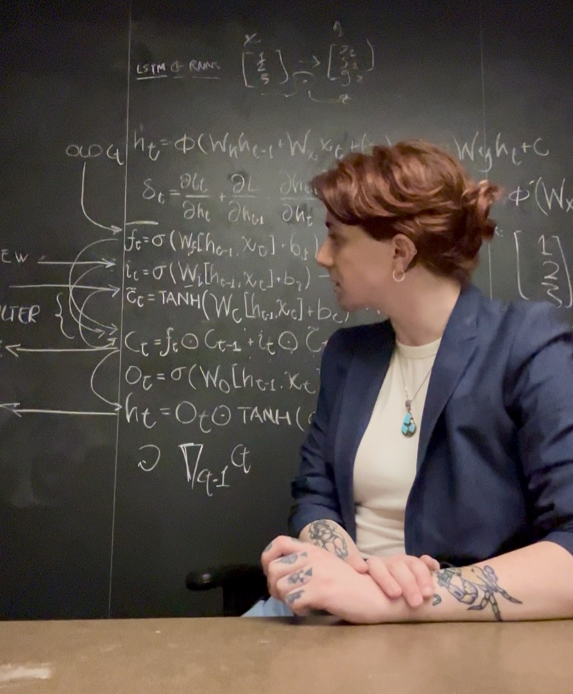
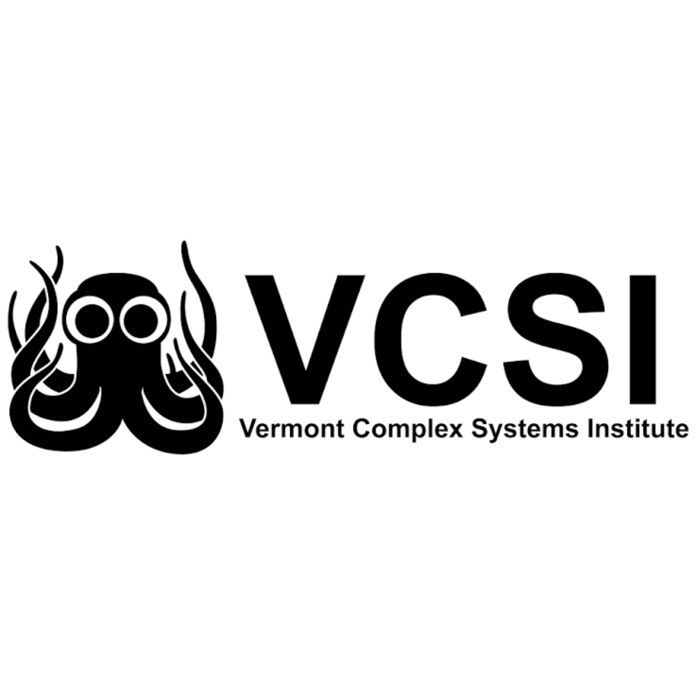

:::: {.home-hero}

::: {.home-photo}
{.headshot alt="Portrait of Samantha Magid"}
:::

::: {.home-info}

# Samantha Magid

Applied and computational mathematician studying scientific productivity, stochastic processes, computational social science, and generative modeling. Unapologetic gay woman in STEM.

[Research](research.qmd) · [Publications](publications.qmd) · [CV](cv.qmd)

::: {.home-contact}
[samantha.magid@uvm.edu](mailto:samantha.magid@uvm.edu)  
[GitHub](https://github.com/crabwife) | 
[Poems and other writings](https://sefermiriam.substack.com/)
:::

:::

::::

::: {.program-logos}

[{.program-logo alt="Vermont Complex Systems Institute"}](https://vermontcomplexsystems.org/){.logo-vcsi}

[{.program-logo alt="University of Vermont"}](https://www.uvm.edu/){.logo-uvm}

[{.program-logo alt="Boston University Faculty of Computing and Data Sciences"}](https://www.bu.edu/cds-faculty/){.logo-cds}

[{.program-logo alt="Boston University Earth and Environment"}](https://www.bu.edu/earth/){.logo-buee}

[{.program-logo alt="BUMP Labs"}](https://www.bu.edu/bump/){.logo-bump}

[{.program-logo alt="Boston University Spark"}](https://www.bu.edu/spark/){.logo-spark}

:::

::: {.homepage-quote}

> “A beach is made of what is there.”

— **A long forgotten Oceanography 101 assigned reading**

_A beach's substrate is composed of local rock. Black beaches form from pulverized lava in Hawaii, glass beaches form from old garbage dumps in Fort Bragg, the ocean-side beaches of Cape Cod form from glacial sediment crushed by the stormy North Atlantic. And then again, the lava comes bursting from the molten depths of the Earth, the glass of Fort Bragg from old kilns and factories that melted sand from other beaches, and the glacial sediment of Cape Cod dragged countless miles southeast of its home. Each is recognizable as a beach, yet each is distinct, a product greater than-- but inseparable from-- its parts, while its parts are inseparable from, but still greater than, what was there in their turn. We are all made of what is there. **A good scientist looks for what is there.**_

:::

## Current Research

My current work asks whether persistent differences in scientific productivity can emerge from parsimonious, history-dependent stochastic processes without requiring stable inherent differences among scholars. The work seeks to debunk the eugenicist, racist suggestions of William Shockley, the white, male Nobel laureate who felt science was too egalitarian for its rewards to be anything but representative of individual merit. Shockley suggested that scientific productivity was the probabilistic result of inherent, immutable, individual traits. As we develop a follow-up to [Scientific Productivity as a Random Walk](https://arxiv.org/pdf/2309.04414), we scientifically validate a long-overdue departure from Shockley's notions.

[Read more about my research →](research.qmd)
