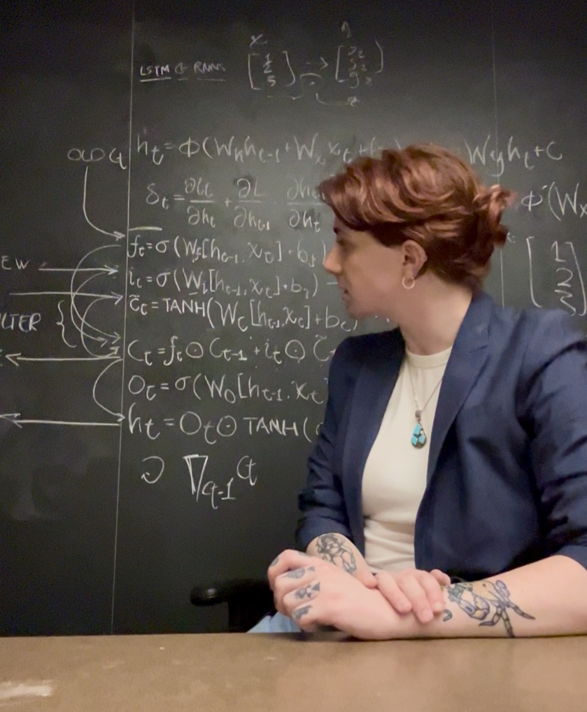
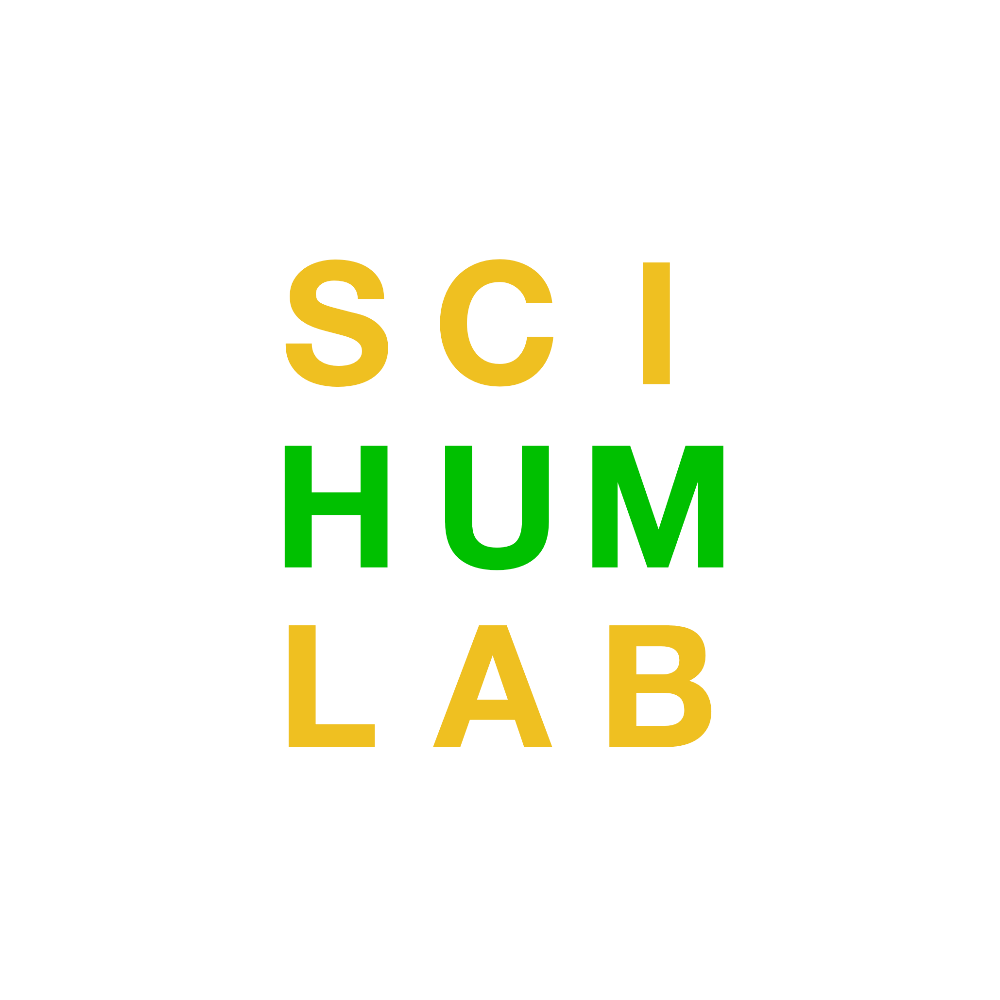
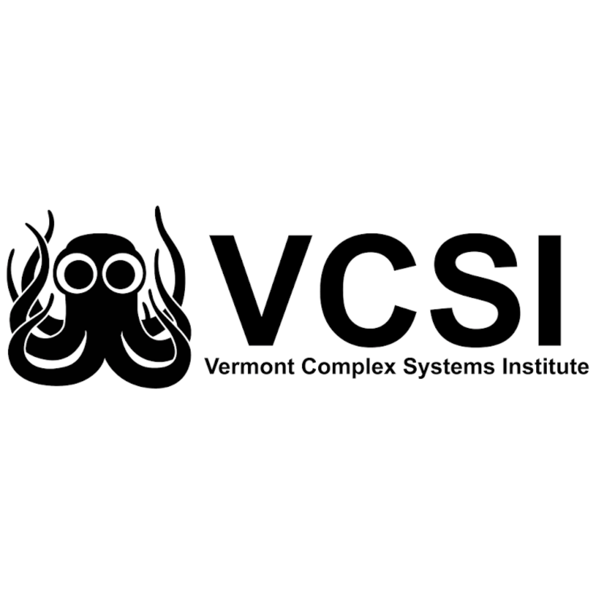
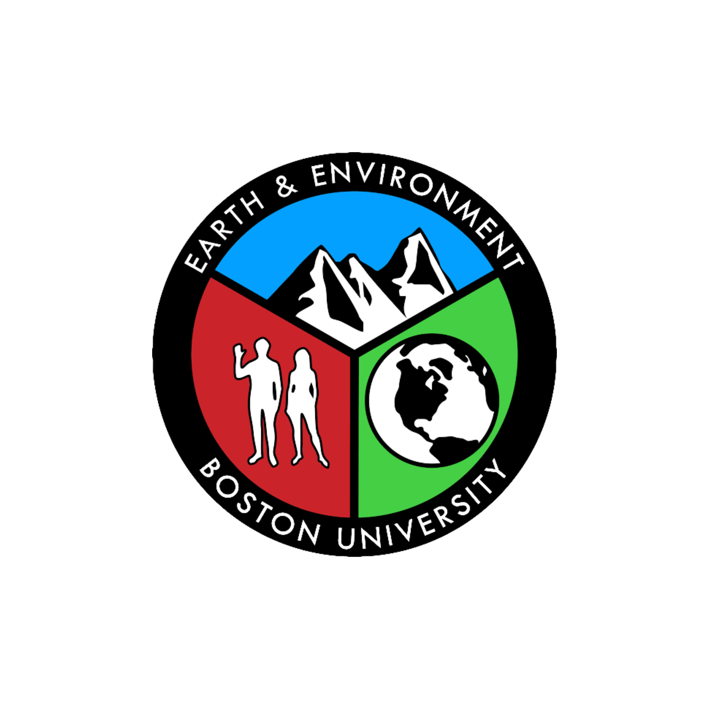

:::: {.home-hero}

::: {.home-photo}
{.headshot alt="Portrait of Samantha Magid"}
:::

::: {.home-info}

# Samantha Magid

Applied and computational mathematician studying scientific productivity, stochastic processes, computational social science, and generative modeling. Researcher at the [Science and Humanity Lab](https://vermontcomplexsystems.org/research/group/science-and-humanity-lab/). Unapologetic gay woman in STEM.

[Research](research.qmd) · [Publications](publications.qmd) · [CV](cv.qmd)

::: {.home-contact}
[samantha.magid@uvm.edu](mailto:samantha.magid@uvm.edu)  
[GitHub](https://github.com/crabwife) | 
[Poems and other writings](https://sefermiriam.substack.com/)
:::

:::

::::

::: {.program-logos}

[{.program-logo alt="Science and Humanity Lab"}](https://scienceandhumanitylab.github.io/){.logo-shl}

[{.program-logo alt="Vermont Complex Systems Institute"}](https://vermontcomplexsystems.org/){.logo-vcsi}

[{.program-logo alt="University of Vermont"}](https://www.uvm.edu/){.logo-uvm}

[{.program-logo alt="Boston University Earth and Environment"}](https://www.bu.edu/earth/){.logo-buee}

[{.program-logo alt="Boston University Faculty of Computing and Data Sciences"}](https://www.bu.edu/cds-faculty/){.logo-cds}

[{.program-logo alt="BUMP Labs"}](https://www.bu.edu/bump/){.logo-bump}

:::

::: {.homepage-quote}

> “A beach is made of what is there.”

— **A long forgotten Oceanography 101 assigned reading**

_A beach's substrate is composed of local rock. Black beaches form from pulverized lava in Hawaii, glass beaches form from old garbage dumps in Fort Bragg, the ocean-side beaches of Cape Cod form from glacial sediment crushed by the stormy North Atlantic. And then again, the lava comes bursting from the molten depths of the Earth, the glass of Fort Bragg from old kilns and factories that melted sand from other beaches, and the glacial sediment of Cape Cod dragged countless miles southeast of its home. Each is recognizable as a beach, yet each is distinct, a product greater than-- but inseparable from-- its parts, while its parts are inseparable from, but still greater than, what was there in their turn. We are all made of what is there. **A good scientist looks for what is there.**_

:::

## Current Research

My current research at the Science and Humanity Lab seeks to identify a discrete compartmental approximation of the generative process of scientific productivity trajectories using computational Bayesian approaches on large datasets from the Academic Analytics Research Center and OpenAlex. My aim is to fill a gap in and harmonize current metascientific literature with a transparent, adaptable, and interpretable mechanistic model that will enable metascientists to better understand scientific productivity. 

Independently, I use multi-agent and NLP-enabled approaches to analyze the use of causal inference across many scientific domains, including assessing the strength and correctness of chains of causal reasoning in recent research. I am also developing and appraising neural network architecture composed of multiple layers of varyingly-stochastic adapted LSTMs.
[Read more about my research →](research.qmd)
